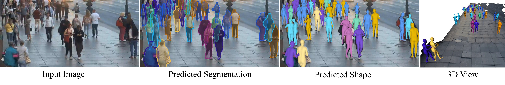

# WALT3D: Generating Realistic Training Data from Time-Lapse Imagery for Reconstructing Dynamic Objects under Occlusion

**CVPR 2024 (Oral, Top 90/11532)**

[](https://www.cs.cmu.edu/~walt3d/)
[](https://arxiv.org/abs/2403.19022)

**WALT3D: Generating Realistic Training Data from Time-Lapse Imagery for Reconstructing Dynamic Objects under Occlusion**

[Khiem Vuong](https://www.khiemvuong.com/)<sup>1</sup>,
[N. Dinesh Reddy](https://dineshreddy91.github.io/)<sup>2</sup>,
[Robert Tamburo](https://www.ri.cmu.edu/ri-people/robert-joseph-tamburo/)<sup>1</sup>,
[Srinivasa G. Narasimhan](https://www.cs.cmu.edu/~srinivas/)<sup>1</sup>

<sup>1</sup>Carnegie Mellon University
<sup>2</sup>Amazon



## Code release status (ETA: July)
- [ ] Demo code and checkpoints
- [ ] Data generation code 
- [ ] Vehicle keypoints dataset release

## Citing WALT3D

If you find this code helpful, please cite:

```
@InProceedings{vuong2024walt3d,
    title={WALT3D: Generating Realistic Training Data from Time-Lapse Imagery for Reconstructing Dynamic Objects under Occlusion},
    author={Vuong, Khiem and Reddy, N Dinesh and Tamburo, Robert and Narasimhan, Srinivasa G},
    booktitle={Proceedings of the IEEE/CVF Conference on Computer Vision and Pattern Recognition (CVPR)},
    year={2024}
}
```
